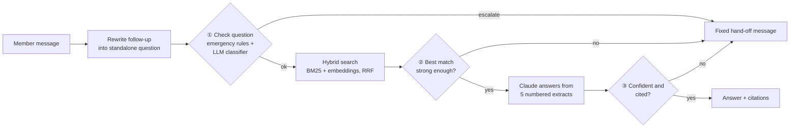

# Medibank Member Support Assistant

A prototype chatbot that answers Medibank members' questions about their health insurance, using
only Medibank's **Fund Rules** and **Member Guide** as its source of truth. Every answer cites the page
and section it came from, and the bot hands the conversation to a human consultant when a question
needs the member's own records, is a complaint, asks for medical advice, is out of scope, or can't be
answered confidently from the documents.

```
Member: What is the waiting period for pregnancy?
Bot:    There's a 12-month waiting period for Pregnancy and birth services... Not every cover
        includes these services, so check your Cover Summary.
        Sources: Member Guide p.21 (Having a baby?) · Fund Rules p.38 (F3.7 Waiting Periods)

Member: Why was my last claim rejected?
Bot:    [Handed to a consultant · account specific]
        I can't see your personal membership details, so I'll connect you with a Medibank
        consultant who can look into this for you. You can also call 132 331.
```

## Quick start

Requires Python 3.12 and an Anthropic API key.

```bash
py -3.12 -m venv .venv
.venv\Scripts\python.exe -m pip install -r requirements.txt
copy .env.example .env          # then put your key in .env: ANTHROPIC_API_KEY=sk-ant-...
.venv\Scripts\python.exe -m src.chunking      # build data/index/chunks.json from the PDFs
.venv\Scripts\python.exe -m streamlit run app.py
```

The app opens at http://localhost:8501. The search index is built on first start (a few seconds).
On macOS/Linux use `.venv/bin/python` instead of `.venv\Scripts\python.exe`.

| Command | What it does | API calls |
|---|---|---|
| `python -m streamlit run app.py` | Chat UI with citations, escalation badges and a debug view | yes |
| `python -m pytest -q` | 42 offline tests (Claude is replaced by fakes) | no |
| `python -m eval.run_eval` | Runs the 30-question evaluation set and writes `eval/results.md` | yes (~60, a few cents) |
| `python -m src.agent` | Command-line demo of a short conversation | yes |

## How it works



**Offline (once):** the two PDFs are read with PyMuPDF, keeping each line's font size and weight.
Headings are detected from font size (Part/Chapter ≥ 18pt, Rule 11pt bold, section 9pt bold), and the
text is split into **285 section-sized chunks**, each tagged with document, page and heading path
(e.g. `C Membership > C9 Temporary Suspension > C9.1 ...`).

**Per message:**

1. **Rewrite** – a follow-up like *"what about extras?"* is rewritten into a standalone question using
   the last 3 turns. Every later step works on one complete question.
2. **① Question check** – emergencies (chest pain, overdose, self-harm...) are caught by regex rules,
   with no LLM call. Everything else goes to a Claude classifier that routes to *answer*,
   *account-specific*, *complaint*, *medical advice* or *out of scope*. The same call also rewrites
   the question in policy terms for search (e.g. "diagnosed with cancer after joining" → pre-existing
   condition, waiting periods), because members rarely use the documents' vocabulary.
3. **Search** – using the member's words plus the policy-term rewrite, BM25 (exact terms like "pre-existing") and a local MiniLM embedding model (paraphrases
   like "expecting a baby" → "Pregnancy and birth") each rank all chunks; Reciprocal Rank Fusion
   combines the two rankings into the top 5.
4. **② Retrieval check** – if the best cosine similarity is below 0.30, nothing in the documents
   really matches, so the bot escalates instead of guessing.
5. **Answer** – Claude answers using only the 5 numbered extracts, via structured output
   (`answer`, `source_ids`, `found_in_sources`, `confidence`).
6. **③ Answer check** – if Claude reports the extracts don't cover the question, or confidence is
   below 0.5, the bot escalates.

Every turn is logged to `logs/chat_log.jsonl` (question, rewritten question, route, chunk ids, scores,
confidence, latency) as an audit trail.

### Project structure

```
src/
  models.py       Pydantic types passed between steps (Chunk, Answer, EscalationDecision, ChatResponse...)
  ingest.py       PDF -> clean lines with font size/bold
  chunking.py     lines -> section chunks with citation metadata
  retrieval.py    hybrid BM25 + embedding search with RRF
  answer.py       grounded answer generation with Claude (structured output)
  escalation.py   the three escalation checks and the fixed hand-off messages
  agent.py        the pipeline: rewrite -> checks -> search -> answer, plus history and logging
app.py            Streamlit UI
eval/             evaluation questions, runner and latest results
tests/            offline pytest suite
data/raw/         the two source PDFs
```

## Scoping assumptions

- **General information only.** The bot doesn't know which product a member holds, so answers that
  depend on cover level say so and point to the member's Cover Summary.
- **No login, no account access.** Questions needing the member's records (claim status, limits used,
  changing details) are handed to a consultant.
- **The two PDFs are the only source of truth.** No outside knowledge, no product prices, no web
  content. Questions they don't cover are escalated rather than answered.
- **Not medical or financial advice.** Medical questions are redirected to a health professional;
  emergencies are directed to 000 and Lifeline.
- **"Escalation" is simulated.** The bot shows a hand-off message and logs the reason; there is no
  real consultant queue.
- **Prototype scope:** English only, single user per browser session, conversation memory lasts for
  the session only, Resident (not Overseas Student/Visitor) member guide.

## Design decisions

| Decision | Why |
|---|---|
| **Fixed pipeline, not an autonomous agent or LangGraph** | Every question follows the same path, and predictability matters for an insurer. A framework would add complexity without a real decision for the model to make. Tools/LangGraph become worthwhile when the bot can call member or claims APIs. |
| **Claude cites extract numbers; code builds the citations** | Claude returns `source_ids: [1, 3]` and our code looks up the real document, page and section. Citations can't be invented. |
| **Fixed wording for every escalation** | Hand-off messages are never generated by the LLM, so they're predictable and safe to review. |
| **Emergencies by rules, other intents by LLM** | Emergency detection must be instant and work even if the API is down. Telling "Am I covered for physio?" (answer) from "Why was my claim rejected?" (account-specific) needs language understanding. |
| **Three escalation checkpoints** | Each catches what the others miss: in eval, "rent a car in Sydney" passed the retrieval threshold (0.34) but was caught by the classifier; "Gold cover price" passed the classifier but was caught after answering. |
| **Hybrid search (BM25 + embeddings, RRF)** | BM25 is precise on policy terms; embeddings handle paraphrases. RRF combines rankings without calibrating two score scales. The raw cosine score is kept as an absolute "is anything relevant?" signal. |
| **Font-based chunking by section** | Chunks follow the documents' own structure (numbered rules, guide topics), so each chunk is one topic and citations are meaningful. |
| **Local embedding model** | Free, fast, and no document text leaves the machine for indexing. |
| **Search query rewritten into policy terms** | Members ask in everyday language; the documents use policy terms. Found when "diagnosed with breast cancer after 1 year, am I covered?" retrieved 0 relevant sections; with the rewrite, 4 of 5 are relevant. It piggybacks on the classifier call, so it adds no latency, and the original question is kept in the search and is what Claude answers. |
| **Follow-ups rewritten before anything else** | Search and classification always see a complete question, and the answer step never sees earlier answers, so it stays grounded in the documents. |

**Model:** `claude-opus-5-5` (set in `src/answer.py`) at low effort, with structured outputs and
server-side refusal fallback. The rewrite and classification steps are simple enough to move to
`claude-haiku-4-5` to cut latency.

## Evaluation

`eval/questions.jsonl` has 30 hand-written cases with ground truth taken from the PDFs: 19 answerable
questions (including a follow-up, a paraphrase with no shared keywords, and two everyday-language
questions about pre-existing conditions) and 11 that should be
escalated (account-specific, complaint, medical advice, out of scope, emergency, and an in-domain
question the documents can't answer).

| Metric | Result |
|---|---|
| Routing accuracy (answer vs. correct escalation category) | 30/30 |
| Escalation precision / recall | 11/11 · 11/11 |
| Retrieval hit@5 (expected section in top 5) | 19/19 |
| Citation accuracy (answer cites an expected section) | 19/19 |
| Key facts present (e.g. "12 months", "30 days") | 12/12 |
| Answer length | median 61 words, max 74 |
| Latency per question | median 4.9s, max 9.8s |

Per-question results are in [eval/results.md](eval/results.md).

**Read with caution:** this is a small set written by the developer, and facts are checked by keyword
rather than by judging the whole answer. Expected-section patterns were audited for looseness (one
pattern matched 165 sections and was tightened). Next steps: an LLM-as-judge for answer faithfulness
and completeness, adversarial and ambiguous questions, and real member questions from logs.

## Known limitations

- **Tables are flattened to text**, so answers about tabular data (e.g. benefit tables) may be less
  precise.
- **The Fund Rules glossary (B2.1) is split by length**, so a definition can be cut across two chunks.
- **Part G of the Fund Rules is labelled under Part F** in section paths (its Part heading isn't
  detected). Rule numbers (e.g. G1.2) are still correct.
- **The embedding cache is invalidated by chunk count only**; delete `data/index/embeddings.npy` after
  changing chunking.
- **Latency is 5–10 seconds** per reply (2–3 sequential API calls). Responses are not streamed.
- **Escalation is a message, not a handoff**: no ticket is created and no context is passed to a person.

## Next steps

- **Personalisation:** connect to member/policy APIs so answers reflect the member's actual product,
  with authentication. This is where tool use and an orchestration framework would earn their place.
- **Real handoff:** create a ticket with the conversation summary and escalation reason.
- **Better structure extraction:** parse tables; split the glossary per defined term; link Member Guide
  sections to the Fund Rules they summarise.
- **Quality and safety:** LLM-as-judge evals in CI, a larger eval set from real questions, guardrails for
  prompt injection, monitoring of escalation rates and low-score questions from the logs.
- **Speed:** stream answers; use a smaller model for rewrite/classification; cache the system prompt.
- **Document updates:** re-index automatically when new versions of the PDFs are published.
